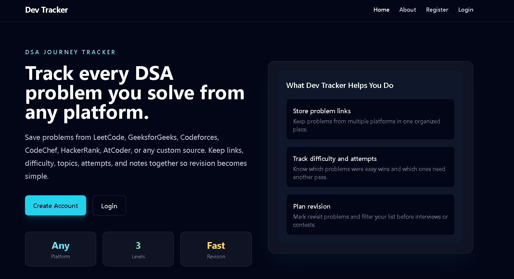
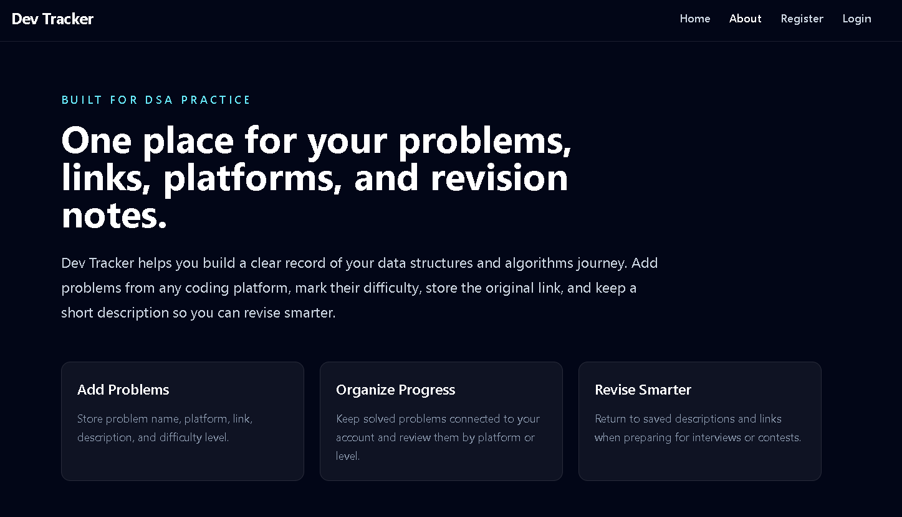
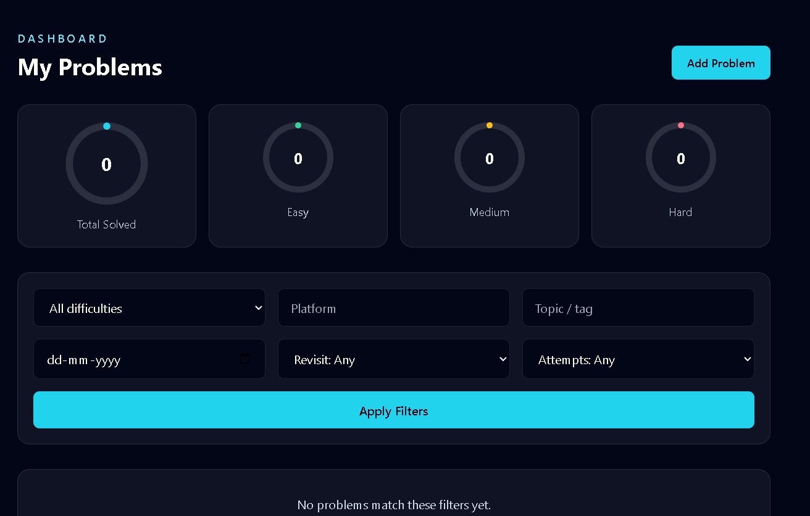
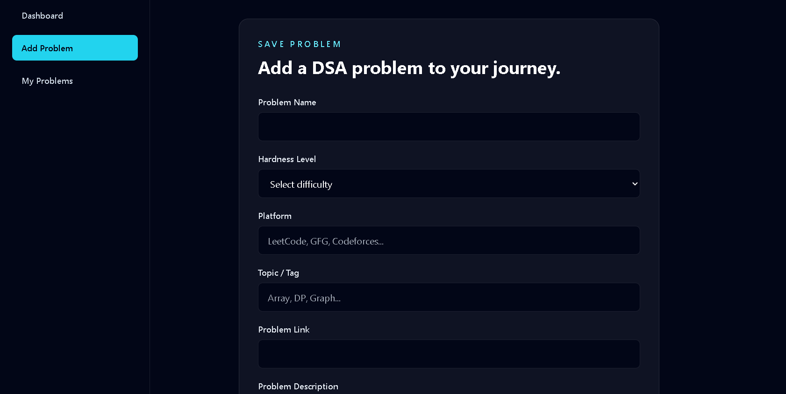

# Dev Tracker

Dev Tracker is a Spring Boot web application for tracking coding problems you solve during interview prep and practice. It supports local account registration and login, OAuth2 sign-in, and a problem log with filtering and progress counts.

## Features

- User registration and email/password login
- OAuth2 login with Google and GitHub
- First OAuth login automatically creates a local account from the provider's verified email
- Add and manage solved coding problems
- Store problem details such as platform, topic, difficulty, solve date, attempts, revisit status, and notes
- Filter problem history by difficulty, platform, topic, date, revisit status, and attempt count
- View progress totals by difficulty
- Thymeleaf-based server-rendered UI

## Tech Stack

- Java 21
- Spring Boot 4.1
- Spring Security
- Spring Data JPA
- Thymeleaf
- MySQL
- OAuth2 Client

## Prerequisites

- Java 21 or newer
- Maven
- MySQL
- OAuth2 credentials for Google and/or GitHub if you want social login enabled

## Configuration

The application reads its settings from `src/main/resources/application.properties`.

Before running the app, update the following values for your environment:

- `spring.datasource.url`
- `spring.datasource.username`
- `spring.datasource.password`
- `spring.security.oauth2.client.registration.google.client-id`
- `spring.security.oauth2.client.registration.google.client-secret`
- `spring.security.oauth2.client.registration.github.client-id`
- `spring.security.oauth2.client.registration.github.client-secret`

For GitHub login, keep `user:email` scope enabled so Dev Tracker can map your GitHub account to your registered email.

Note: do not commit real credentials to version control. Use environment variables or a local override file if possible.

## Run Locally

```bash
mvn spring-boot:run
```

The application starts on `http://localhost:8080`.

## Database

The app uses MySQL and will create the `dev_tracker` database automatically if it does not already exist, based on the configured JDBC URL.

## Main Routes

- `/` redirects to the home page
- `/devtracker/home` home page
- `/devtracker/about` about page
- `/register` user registration
- `/login` login page
- `/problems` list of tracked problems
- `/problems/add` add a new problem

## Project Structure

- `controller/` web controllers for pages, auth, and problem management
- `entities/` JPA entities and enums
- `form/` form backing objects
- `repositories/` Spring Data repositories
- `services/` service interfaces
- `serviceImplementation/` service implementations
- `templates/` Thymeleaf views

## Screenshot

    

  

## License

No license has been specified yet.
