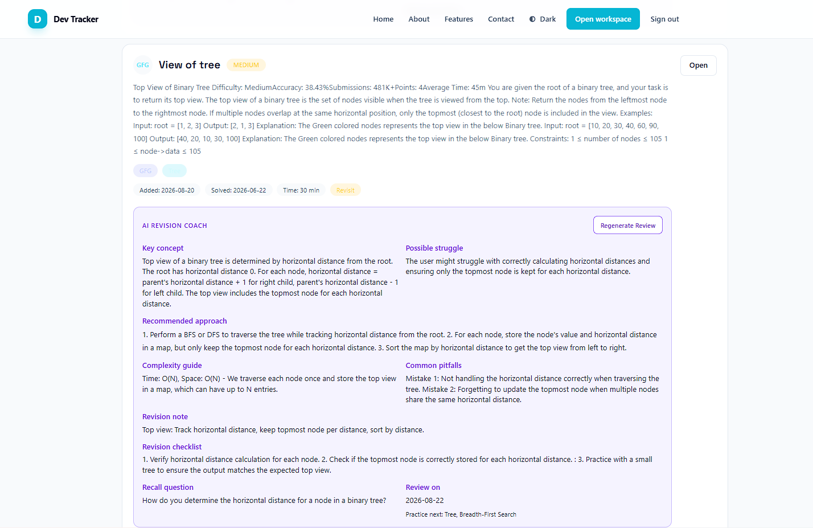
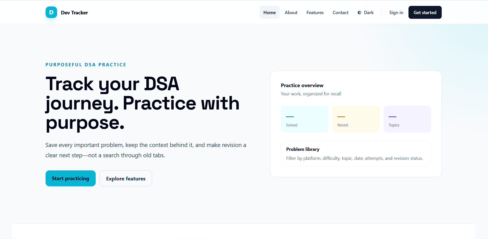
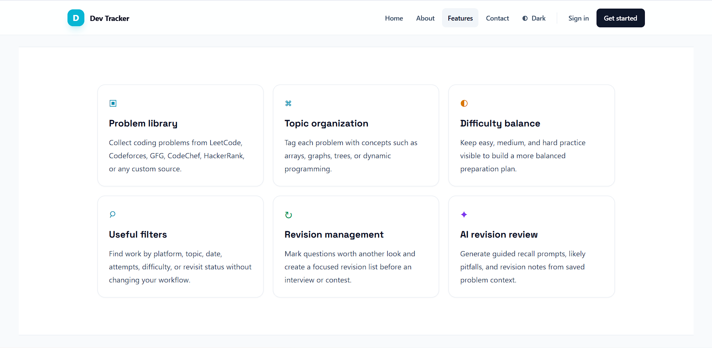
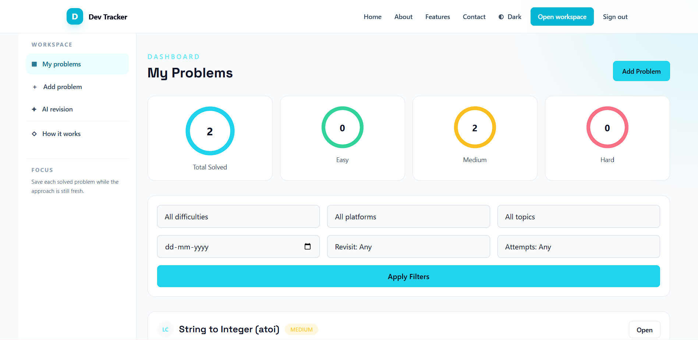

# Dev Tracker

Dev Tracker is a Spring Boot web application for tracking algorithm and data-structure problems while preparing for interviews. It helps developers record problems they solve, capture context and notes, track attempts and revisits, and measure progress over time.

This README has been updated to reflect the project's current development state, local setup, and deployment options.

---

## Key features

- Local account registration and email/password login
- OAuth2 sign-in (Google and GitHub) with automatic local-account creation on first verified-email login
- Add and manage solved problems with metadata: platform (LeetCode, Codeforces, etc.), topic, difficulty, solve date, attempts, revisit status, and notes
- Filterable problem library (platform, topic, difficulty, date range, attempts, revisit status)
- Progress overview / aggregates (counts by difficulty, revisit queue, recent activity)
- Server-rendered UI using Thymeleaf (responsive, accessible layouts)
- Role-based security spots prepared to extend (user / admin)

---

## Tech stack

- Java 21
- Spring Boot 4.x
- Spring Security (with OAuth2 client)
- Spring Data JPA (Hibernate)
- Thymeleaf (server-side templates)
- MySQL (can be switched to any JDBC-compatible DB)
- Maven build tooling

---

## Repository layout (important folders)

- [src/main/java/](/D:/Java_Backend/Spring Boot/Dev Tracker/src/main/java/) - application source code
- [src/main/resources/application.properties](/D:/Java_Backend/Spring Boot/Dev Tracker/src/main/resources/application.properties) - main configuration
- [src/main/resources/templates/](/D:/Java_Backend/Spring Boot/Dev Tracker/src/main/resources/templates/) - Thymeleaf templates (HTML views)
- [src/main/resources/static/](/D:/Java_Backend/Spring Boot/Dev Tracker/src/main/resources/static/) - static assets (CSS, JS, images)

---

## Prerequisites

- Java 21 (or newer) installed and JAVA_HOME configured
- Maven 3.6+ (or compatible) on PATH
- MySQL server (or use Docker-based MySQL) and a database user

Note: for development, using a local MySQL instance or a Docker container is recommended.

---

## Configuration (environment & secrets)

The application loads settings from `src/main/resources/application.properties` by default. For any values that are sensitive or environment-specific, prefer environment variables or externalized configuration (for example, `application-local.properties` which should be Git-ignored).

Important properties (set these before first run)

- spring.datasource.url — JDBC URL (example: jdbc:mysql://localhost:3306/dev_tracker?createDatabaseIfNotExist=true)
- spring.datasource.username
- spring.datasource.password
- spring.jpa.hibernate.ddl-auto — for development `update` is convenient; for production prefer using a migration tool and set to `validate` or `none`

OAuth2 (optional):
- spring.security.oauth2.client.registration.google.client-id
- spring.security.oauth2.client.registration.google.client-secret
- spring.security.oauth2.client.registration.github.client-id
- spring.security.oauth2.client.registration.github.client-secret

Ollama / Local AI (optional):
- spring.ai.ollama.base-url — base URL for a local Ollama server (default: http://localhost:11434). The AI-based "Revision Review" feature requires Ollama (or another supported model backend) running and reachable.
- spring.ai.ollama.chat.options.model — model identifier used by the app

Security & secrets (READ THIS BEFORE PUBLISHING)

- Do NOT keep real credentials in `src/main/resources/application.properties` in the repository. If credentials are already committed, rotate/revoke those credentials immediately (OAuth client secrets, database passwords, API keys).
- Create an example file: `src/main/resources/application.properties.example` with placeholders (no secrets). Example content:

  spring.datasource.url=jdbc:mysql://localhost:3306/dev_tracker?createDatabaseIfNotExist=true
  spring.datasource.username=your_db_user
  spring.datasource.password=your_db_password
  spring.jpa.hibernate.ddl-auto=update

  # OAuth placeholders
  spring.security.oauth2.client.registration.google.client-id=YOUR_GOOGLE_CLIENT_ID
  spring.security.oauth2.client.registration.google.client-secret=YOUR_GOOGLE_CLIENT_SECRET

- Use environment variables for sensitive values in CI and production. Spring Boot supports binding environment variables (e.g. SPRING_DATASOURCE_URL) and external config files.
- Keep local override files (application-local.properties) in `.gitignore` so they are never committed. The repository's `.gitignore` already lists patterns for application-* and local files; ensure local secrets are removed from tracked files.

Maven wrapper and local build

This project includes the Maven Wrapper so contributors do not need a system-level Maven install. Prefer using the wrapper commands:

- On Windows (PowerShell or cmd): .\mvnw.cmd clean package
- On macOS / Linux / Git Bash: ./mvnw clean package
- Run the app in development: ./mvnw spring-boot:run (or .\mvnw.cmd on Windows)

The wrapper is configured in `.mvn/wrapper/maven-wrapper.properties` (Maven version 3.9.16 in this repo).

Running tests

- Run all tests: ./mvnw test
- Run a single test class: ./mvnw -Dtest=ProblemControllerTest test

Database migrations (production readiness)

- For production use, add a migration tool such as Flyway or Liquibase and commit migration scripts under `src/main/resources/db/migration/` (Flyway convention). This prevents relying on `hibernate.ddl-auto=update` in production.
- Example Flyway resources folder: `src/main/resources/db/migration/V1__initial_schema.sql`

Docker & local development (recommended)

- It's recommended to add a Dockerfile for the Spring Boot JAR and a `docker-compose.yml` for local development containing a MySQL service and the app service. A minimal example (illustrative only):

  version: '3.8'
  services:
    db:
      image: mysql:8.0
      environment:
        MYSQL_ROOT_PASSWORD: example
        MYSQL_DATABASE: dev_tracker
        MYSQL_USER: dev
        MYSQL_PASSWORD: dev
      ports:
        - "3306:3306"
    app:
      build: .
      depends_on:
        - db
      environment:
        SPRING_DATASOURCE_URL: jdbc:mysql://db:3306/dev_tracker
        SPRING_DATASOURCE_USERNAME: dev
        SPRING_DATASOURCE_PASSWORD: dev
      ports:
        - "8080:8080"

- If you want, a Dockerfile and a docker-compose.yml can be added to the repo — ask and a suggested set of files will be created.

CI / GitHub Actions

- The repository does not currently include CI workflows. A recommended GitHub Action should:
  - Use the Maven wrapper to build: `./mvnw -B -DskipTests package`
  - Run tests: `./mvnw test`
  - Optionally build and push a Docker image on releases/tags

Accessibility & UX: screenshots

- Images are stored in `docs/screenshots/` and referenced in this README for visual documentation. Optimize images before pushing to keep repo size reasonable.

Support & next steps

- If the repository should be prepared for public release, the immediate steps are: remove secrets from tracked files, add `application.properties.example`, rotate credentials, and add simple CI + Docker files.
- I can (on request) create the `application.properties.example`, update README with exact environment variable examples, add a Dockerfile/docker-compose, or prepare a GitHub Actions workflow — tell me which you want done next.

---

## Run locally

1. Build the project:

   mvn -DskipTests package

2. Run with Maven:

   mvn spring-boot:run

   or run the packaged JAR:

   java -jar target/dev-tracker-*.jar

3. Open the app at: http://localhost:8080

Default port can be changed via `server.port` in application properties or an environment variable.

---

## Database setup and migrations

- The project currently relies on Spring Data JPA for schema creation in development. Configure `spring.jpa.hibernate.ddl-auto` as needed.
- For production use, add a migration tool (Flyway or Liquibase) and commit migration scripts to `src/main/resources/db/migration/`.

---

## OAuth2/social login notes

- Google: configure an OAuth client in Google Cloud Console; authorized redirect URI should be http://localhost:8080/login/oauth2/code/google (adjust host/port for your environment)
- GitHub: register an OAuth App in GitHub settings; use the same redirect URI pattern
- For GitHub, enable the user:email scope so the application can map provider accounts to verified emails

---

## Docker (development)

A simple Docker Compose setup is useful for local development (MySQL + app). Example steps:

1. Add a `Dockerfile` for the Spring Boot app (if not present)
2. Add `docker-compose.yml` with a MySQL service and the app service

When using Docker Compose, ensure environment variables for DB credentials and OAuth secrets are injected into the app container.

---

## Tests

- Unit and integration tests can be run with Maven:

  mvn test

- For targeted tests, use Maven's `-Dtest=...` option.

---

## UI / Screenshots

The app has a responsive, user-focused landing page and a dashboard view for the problem library and progress overview.

The screenshots provided have been copied into the repository so they render on GitHub. Relative paths to the images are used below.

Screenshots (stored in docs/screenshots/):

Notes:
- Images are stored in `docs/screenshots/` and referenced with relative paths so they render correctly on GitHub.
- If the images are larger than desired for the README, they can be optimized (resize/compress) before committing; ask if you want them optimized.

---

## Development notes

- Controllers live in `controller/` and return Thymeleaf views from `templates/`
- Services follow typical service/repository layering; business logic should remain in service classes
- Security is configured via Spring Security; look into `SecurityConfig` classes for auth customizations
- To extend: add custom problem import/export, tagging, revision scheduling, or an API for a client-side SPA

---

## Contributing

Contributions are welcome. Suggested process:

1. Fork the repository
2. Create a feature branch: `git checkout -b feat/brief-description`
3. Run and test locally
4. Open a pull request with a clear description of changes and testing steps

Please avoid committing secrets. Add tests for significant logic changes where possible.

---

## Troubleshooting

- Database connection failures: verify JDBC URL, credentials, and that MySQL accepts connections from your host
- OAuth redirects: check the provider app settings and ensure redirect URIs exactly match the running app's login callback
- Template errors: look for missing model attributes in controller methods that render Thymeleaf templates

---

## License

No license specified. Add an appropriate open-source license (MIT, Apache-2.0, etc.) in a `LICENSE` file if you intend to make the project public.

---

If additional details, screenshots, or a different README structure are preferred, provide guidance and the README will be adjusted accordingly.
