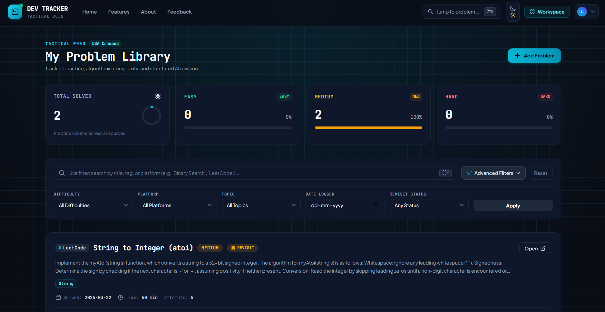

# Dev Tracker // Tactical DSA Command Center

<p align="center">
  
</p>

<p align="center">
  
  
  
  
  
  
  
  
</p>

<p align="center">
  🌐 <b>Live Production App:</b> <a href="https://dev-tracker-1q3t.onrender.com" target="_blank">https://dev-tracker-1q3t.onrender.com</a>
</p>

**Dev Tracker** is a developer's tactical command center for deliberate data structure & algorithm (DSA) practice and technical interview preparation. 

Rather than treating practice as a meaningless solved count, Dev Tracker bridges the gap between solving a problem today and retaining its core invariant during a live technical interview months later.

---

## 📸 Visual Tour

### 1. Tactical Command Center & Metric Deck
The command center dashboard features real-time volume metrics, an animated circular progress ring, and linear balance meters for Easy, Medium, and Hard challenges. Includes a sub-50ms instant debounced search (`⌘K`) and multi-criteria persistent filters.

<p align="center">
  
</p>

---

### 2. Interactive AI Revision Intelligence Panel
Powered by Spring AI and Gemini, this collapsible panel provides automated asymptotic complexity analysis (`O(N)` Time / `O(1)` Space), common failure traps, pre-interview checklists, and timed active recall quizzes.

<p align="center">
  
</p>

---

### 3. Multi-Platform Problem Feed
A centralized repository tracking challenges across LeetCode, Codeforces, GeeksforGeeks, CodeChef, and HackerRank with monospace platform badges (`#LeetCode`, `#GFG`), difficulty indicators, and solve statistics.

<p align="center">
  
</p>

---

### 4. High-Craft Landing Page & Live Invariant Preview
An engineered hero section with tactical typography, interactive problem card mockups, and quick launch actions.

<p align="center">
  
</p>

---

### 5. Architectural Specifications & Bento Grid
Comprehensive capability breakdown showcasing ingestion velocity, algorithmic taxonomy, spaced revisit scheduling, and difficulty balance visualizers.

<p align="center">
  
</p>

---

## ⚡ Core Capabilities

### 1. ✦ Gemini AI Revision Coach (Spring AI + Gemini)
- Powered by Google's Gemini Developer API via **Spring AI**. The default `gemini-3.6-flash` model is available within Gemini's free tier, subject to its rate limits.
- Automatically synthesizes:
  - **Optimal Asymptotic Complexity**: Worst-case Time & Space complexity bounds (`O(N)`).
  - **Core Invariant & Approach**: The fundamental algorithmic intuition formatted in clean Markdown.
  - **Common Pitfalls & Edge Cases**: What trips developers up on test cases.
  - **Spaced Recall Quiz**: Timed questions to verify active retrieval from memory rather than passive recognition.

### 2. ⚡ Intelligent Ingestion & URL Auto-Detection
- Paste problem links from **LeetCode**, **Codeforces**, **GeeksforGeeks**, **CodeChef**, or **HackerRank**.
- The client-side ingestion engine automatically detects the platform and formats the problem title from the URL slug.

### 3. 📊 Tactical Metric Deck (Windster-Style)
- **Total Solved Ring Gauge**: Animated circular progress meter tracking overall volume.
- **Difficulty Balance Meters**: Linear Emerald (Easy), Amber (Medium), and Rose (Hard) progress meters with real-time percentage distributions to prevent lopsided preparation.

### 4. 🔎 Sub-50ms Instant Search & Tactical Toolbar
- Client-side debounced search filtering cards in real-time as you type.
- Global keyboard shortcut: Press **`⌘K`** (or **`Ctrl+K`**, or **`/`**) anywhere to focus the search bar.
- Persistent server-side multi-parameter filters (Difficulty, Platform, Topic Tags, Date Logged, and Revisit Status).

### 5. 🔖 Spaced Repetition & Revisit Queue
- Flag non-trivial edge cases or multi-pointer problems for spaced review.
- Filter down to your bookmark queue 48 hours before an interview for high-yield recall drills.

### 6. 🌗 Tactical Dark & Light Mode (Zero-Flash)
- Engineered grid canvas (`.bg-grid-pattern`) with subtle cyan phosphor glow.
- Zero-flash theme initialization syncing with `localStorage` and system `prefers-color-scheme`.
- Replaced plain text glyphs (`☰`, `▦`, `✦`) with a pixel-perfect **Heroicons SVG fragment engine**.

### 7. 🔐 Multi-Provider Authentication
- Local account registration with BCrypt password hashing.
- **OAuth2 Social Sign-In** via Google and GitHub with automatic account provisioning on first verified email login.

---

## 🛠️ Technology Stack

| Layer | Technologies |
| :--- | :--- |
| **Backend Core** | Java 21, Spring Boot 4.x, Spring MVC, Spring Data JPA (Hibernate) |
| **AI Integration** | Spring AI 2.0.0, Gemini Developer API (`gemini-3.6-flash`), native structured chat output |
| **Security & Auth** | Spring Security 6.x, OAuth2 Client (Google & GitHub), BCrypt |
| **Database** | MySQL 8.x, TiDB Cloud Serverless (Production Cloud MySQL) |
| **DevOps & Cloud** | Docker (Multi-stage build), Docker Compose, Render Blueprint (`render.yaml`) |
| **Frontend Templates** | Thymeleaf 3.x (Server-Rendered, Zero React/SPA overhead) |
| **Styling & UI** | Tailwind CSS (Forms & Typography plugins), Flowbite 2.5.2, Heroicons SVGs |
| **Client Scripting** | Vanilla JavaScript, GSAP 3.12 (Motion & Micro-interactions) |
| **Configuration** | Java `.env` loader (`spring.config.import=optional:file:.env[.properties]`) |

---

## 📁 Repository Structure

```text
├── docs/
│   └── screenshots/              # UI screenshots and visual documentation
│       ├── dashboard-metrics.png # Dashboard with metric counters
│       ├── dashboard-revision.png# AI Revision Intelligence panel
│       ├── features-grid.png     # Features and specifications bento grid
│       ├── home-hero.png         # Landing page hero with live mockup
│       └── my-problems.png       # Problem library feed
├── src/
│   ├── main/
│   │   ├── java/com/devtracker/
│   │   │   ├── config/           # SecurityConfig, OAuth2 handler, JPA config
│   │   │   ├── controller/       # ProblemController, AuthController, PageController
│   │   │   ├── entities/         # User, Problem, AiReview JPA entities
│   │   │   ├── repository/       # Spring Data JPA repositories
│   │   │   ├── services/         # ProblemService, AiReviewService, UserService
│   │   │   └── DevTrackerApplication.java
│   │   └── resources/
│   │       ├── application.properties    # Base Spring configuration
│   │       ├── static/
│   │       │   ├── css/app.css   # Tactical grid tokens, glass panels, cards
│   │       │   └── js/app.js     # Theme toggle, instant search, URL auto-detect
│   │       └── templates/
│   │           ├── base.html     # Root layout, Google Fonts, Tailwind CDN & plugins
│   │           ├── fragments.html# Heroicon SVG engine, Windster sidebar, Navbar, Toasts
│   │           ├── home.html     # High-craft landing page & interactive preview
│   │           ├── services.html # System features & bento architecture
│   │           ├── about.html    # Engineering manifesto & recall methodology
│   │           ├── contact.html  # Communication relay form
│   │           ├── problems/
│   │           │   ├── list.html # Problem feed, metric deck, AI accordion
│   │           │   └── add.html  # Tactical multi-step ingestion form
│   │           └── user/
│   │               ├── login.html    # Split-screen auth with Google/GitHub buttons
│   │               └── register.html # Account deployment form
├── .dockerignore                 # Excludes build artifacts and secrets from Docker builds
├── .env.example                  # Environment variables template
├── docker-compose.yml            # Local multi-container stack (App + MySQL 8)
├── Dockerfile                    # Multi-stage production build (Java 21 + Maven)
├── pom.xml                       # Maven build configuration
├── render.yaml                   # Render Blueprint (Infrastructure-as-Code)
└── README.md
```

---

## 🚀 Getting Started

### 1. Prerequisites
- **Java 21** or newer (`java -version`).
- **MySQL Server** (running locally on port `3306` or via Docker).
- A free [Google AI Studio](https://aistudio.google.com/) account and a Gemini Developer API key (for AI Revision Review).

### 2. Environment Configuration
Copy the `.env.example` file to `.env`:
```bash
cp .env.example .env
```
Update `.env` with your local database credentials, OAuth keys, and Gemini API key:
```env
# Database Credentials
DB_URL=jdbc:mysql://localhost:3306/dev_tracker?createDatabaseIfNotExist=true
DB_USERNAME=root
DB_PASSWORD=your_mysql_password

# Google OAuth2 (Optional)
GOOGLE_CLIENT_ID=your_google_client_id
GOOGLE_CLIENT_SECRET=your_google_client_secret

# GitHub OAuth2 (Optional)
GITHUB_CLIENT_ID=your_github_client_id
GITHUB_CLIENT_SECRET=your_github_client_secret

# Gemini Developer API (free tier)
GEMINI_API_KEY=your_gemini_api_key
```

> [!NOTE]
> `.env` is listed in `.gitignore` to prevent credentials from ever leaking into source control.

### 3. Switch to Gemini's free tier
The project is already configured for Gemini. Complete these steps before starting the application:

1. Open [Google AI Studio](https://aistudio.google.com/app/apikey), sign in, and choose **Create API key**.
2. Copy the key into the `GEMINI_API_KEY` value in your local `.env` file. Do not commit this file or paste the key into source code.
3. Keep `spring.ai.google.genai.chat.model=gemini-3.6-flash` in `application.properties`. This is the configured free-tier model and supports the structured review response used by Dev Tracker.
4. Start the app, sign in, open **My Problems**, and select **Generate AI Review** on a problem to verify the integration.
5. If a request is rejected, confirm the key is active in AI Studio and check the current free-tier rate limits. Free tier availability and quotas can change; wait for the quota window to reset or use a paid tier if your usage exceeds the limit.

Ollama and downloaded local models are no longer required.

---

### 4. Build & Run

#### Running with Maven:
```powershell
# On Windows
.\mvnw.cmd spring-boot:run

# On Linux / macOS
./mvnw spring-boot:run
```

#### Running the Packaged JAR:
```bash
# Package the application
./mvnw clean package -DskipTests

# Run the executable JAR
java -jar target/dev-tracker-0.0.1-SNAPSHOT.jar
```

#### Open the Application:
Once started, navigate to:
```
http://localhost:8080
```
- **Landing Page**: `http://localhost:8080/devtracker/home`
- **Dashboard Workspace**: `http://localhost:8080/problems`
- **Log Problem**: `http://localhost:8080/problems/add`

---

### 5. Run with Docker & Docker Compose (Zero Setup)

You can run the entire stack (Spring Boot app + MySQL 8 container with health checks and persistent volume) using a single command:

```powershell
# Build and start both app and MySQL
docker compose up --build

# Stop the containers
docker compose down

# Stop and wipe database volume
docker compose down -v
```

The app will be accessible at `http://localhost:8080` and the database at `localhost:3306`.

---

### 6. Deploy to Render (Production Cloud)

Dev Tracker is pre-configured for **Render** via [render.yaml](render.yaml) and [Dockerfile](Dockerfile).

#### A. Database (TiDB Cloud Serverless / Free MySQL)
Because Render does not offer managed MySQL on its free tier, use [TiDB Cloud Serverless](https://tidbcloud.com/) (free forever, MySQL-compatible):
1. Create a free cluster on TiDB Cloud.
2. In **Security** / **Networking**, allow `0.0.0.0/0`.
3. Obtain your JDBC connection details.

#### B. Deploying via Render Blueprint
1. Push your repository to GitHub.
2. On [Render Dashboard](https://dashboard.render.com/), click **New +** > **Blueprint**.
3. Select your repository. Render will automatically detect `render.yaml`.
4. Supply your environment variables:
   - `DB_URL`: `jdbc:mysql://<tidb-host>:4000/test?sslMode=VERIFY_IDENTITY`
   - `DB_USERNAME`: `<cluster-prefix>.root`
   - `DB_PASSWORD`: `<your-tidb-password>`
   - `GEMINI_API_KEY`: `<your-gemini-key>`
   - `GOOGLE_CLIENT_ID` & `GOOGLE_CLIENT_SECRET`
   - `GITHUB_CLIENT_ID` & `GITHUB_CLIENT_SECRET`
5. Click **Apply**. Render will automatically build the multi-stage Docker image and launch the service.

#### C. OAuth Callback Configuration
Once your service URL is live (e.g. `https://<your-app>.onrender.com`), add the redirect URIs:
- **Google Cloud Console**:
  ```text
  https://<your-app>.onrender.com/login/oauth2/code/google
  ```
- **GitHub Developer Settings**:
  ```text
  https://<your-app>.onrender.com/login/oauth2/code/github
  ```

---

## 🧪 Testing

Run test suites via Maven:
```bash
./mvnw test
```
To run targeted test classes:
```bash
./mvnw -Dtest=ProblemControllerTest test
```

---

## 🎨 Design System & Credits
- **UI Architecture**: Inspired by **Themesberg Windster Dashboard** and **Flowbite**.
- **Iconography**: **Heroicons** by Tailwind Labs.
- **AI Design Methodology**: Rooted in **Anshu Chimala's Double Diamond AI Design process** (featured in *Lenny's Newsletter*), rejecting generic AI slop in favor of purposeful, tactile developer tools.

---

## 📄 License
This project is open-source under the MIT License.
