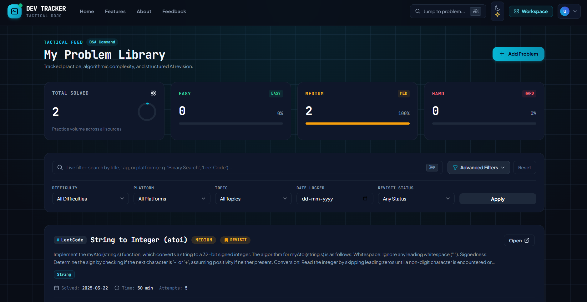
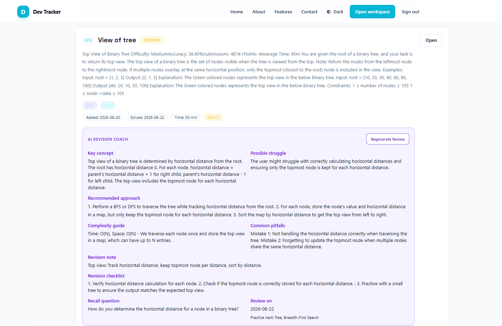
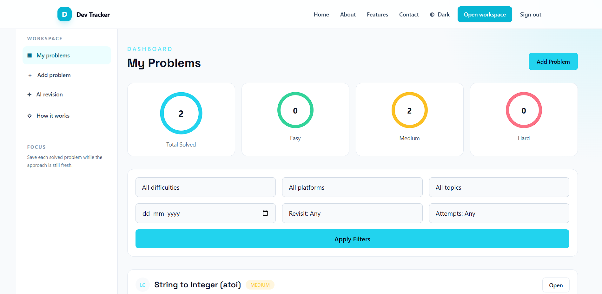
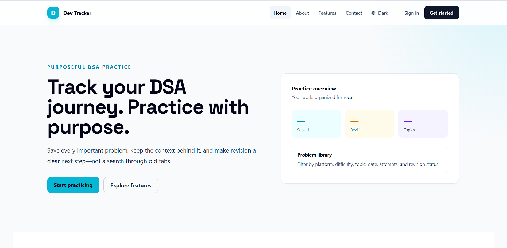
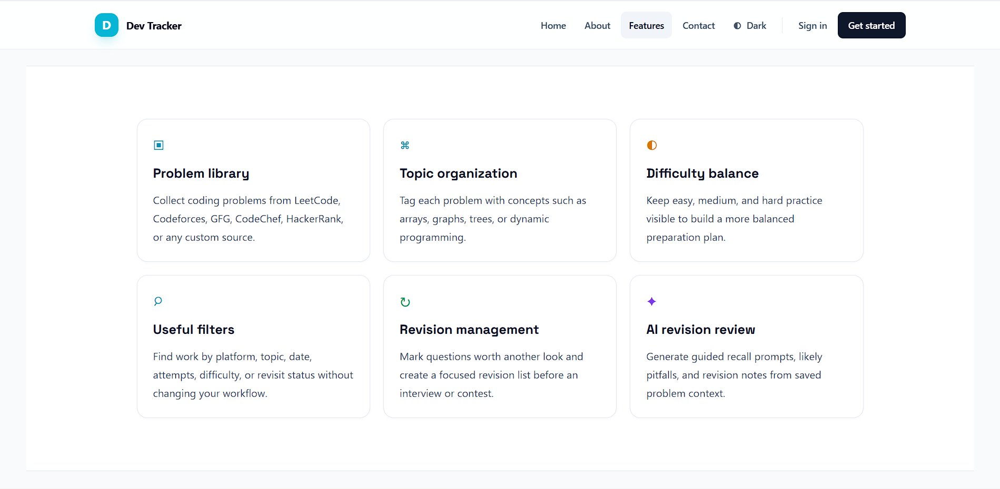
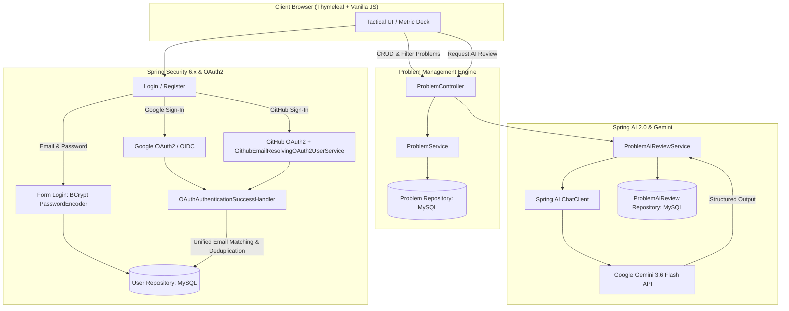
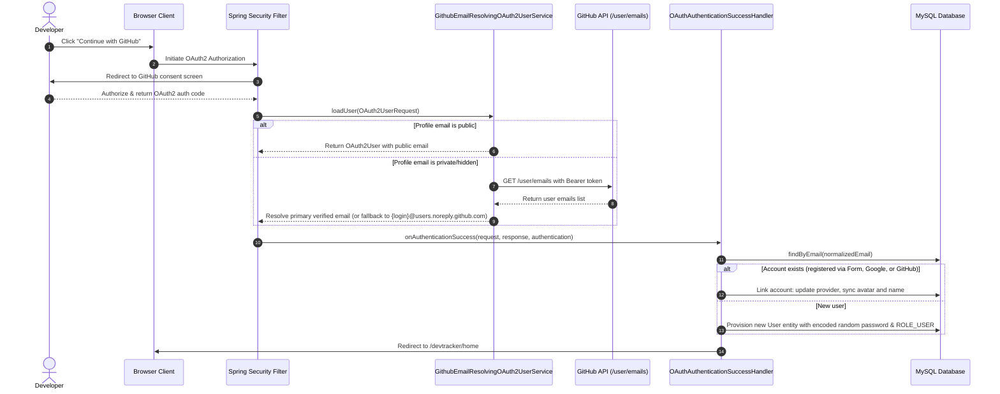

# Dev Tracker // Tactical DSA Command Center

<p align="center">
  
</p>

<p align="center">
  
  
  
  
  
  
  
  
</p>

<p align="center">
  🌐 <b>Live Production App:</b> <a href="https://dev-tracker-1q3t.onrender.com" target="_blank">https://dev-tracker-1q3t.onrender.com</a>
</p>

**Dev Tracker** is a developer's tactical command center for deliberate data structure & algorithm (DSA) practice and technical interview preparation. 

Rather than treating practice as a vanity solved count, Dev Tracker bridges the gap between solving a problem today and retaining its core invariant during a live technical interview months later.

---

## 📸 Visual Tour

### 1. Tactical Command Center & Metric Deck
The command center dashboard features real-time volume metrics, an animated circular progress ring, and linear balance meters for Easy, Medium, and Hard challenges. Includes a sub-50ms instant debounced search (`⌘K`) and multi-criteria persistent filters.

<p align="center">
  
</p>

---

### 2. Interactive AI Revision Intelligence Panel
Powered by Spring AI and Gemini, this collapsible panel provides automated asymptotic complexity analysis (`O(N)` Time / `O(1)` Space), common failure traps, pre-interview checklists, and timed active recall quizzes.

<p align="center">
  
</p>

---

### 3. Multi-Platform Problem Feed
A centralized repository tracking challenges across LeetCode, Codeforces, GeeksforGeeks, CodeChef, and HackerRank with monospace platform badges (`#LeetCode`, `#GFG`), difficulty indicators, and solve statistics.

<p align="center">
  
</p>

---

### 4. High-Craft Landing Page & Live Invariant Preview
An engineered hero section with tactical typography, interactive problem card mockups, and quick launch actions.

<p align="center">
  
</p>

---

### 5. Architectural Specifications & Bento Grid
Comprehensive capability breakdown showcasing ingestion velocity, algorithmic taxonomy, spaced revisit scheduling, and difficulty balance visualizers.

<p align="center">
  
</p>

---

## ⚡ Core Capabilities

### 1. ✦ Gemini AI Revision Coach (Spring AI + Gemini)
- Powered by Google's Gemini Developer API via **Spring AI 2.0.0**. The default `gemini-3.6-flash` model delivers low-latency structured output within Gemini's free tier.
- Automatically synthesizes:
  - **Optimal Asymptotic Complexity**: Worst-case Time & Space complexity bounds (`O(N)` Time / `O(1)` Space).
  - **Core Invariant & Approach**: The fundamental algorithmic intuition formatted into 3–5 ordered conceptual steps without spoiling full code solutions.
  - **Common Pitfalls & Edge Cases**: Concrete traps that cause WA (Wrong Answer) or TLE (Time Limit Exceeded).
  - **Actionable Revision Checklist**: Concrete drills to execute before retrying the problem.
  - **Spaced Recall Quiz**: Timed self-test questions designed to test mental retrieval rather than passive recognition.
  - **Curated Next Topics & Revision Scheduling**: Auto-suggested revision dates (1–30 days) and approved tag suggestions from a verified taxonomy.

### 2. ⚡ Intelligent Ingestion & URL Auto-Detection
- Paste problem links from **LeetCode**, **Codeforces**, **GeeksforGeeks**, **CodeChef**, or **HackerRank**.
- The client-side ingestion engine automatically detects the target platform, extracts the problem title from the URL slug, and normalizes metadata.

### 3. 📊 Tactical Metric Deck (Windster-Style)
- **Total Solved Ring Gauge**: Animated circular SVG progress meter tracking overall volume against milestones.
- **Difficulty Balance Meters**: Linear Emerald (Easy), Amber (Medium), and Rose (Hard) progress meters with real-time percentage distributions to prevent lopsided preparation.

### 4. 🔎 Sub-50ms Instant Search & Tactical Toolbar
- Client-side debounced search filtering cards in real-time as you type.
- Global keyboard shortcut: Press **`⌘K`** (or **`Ctrl+K`**, or **`/`**) anywhere to focus the search bar.
- Persistent server-side multi-parameter filters (Difficulty, Platform, Topic Tags, Date Logged, and Revisit Status).

### 5. 🔖 Spaced Repetition & Revision Tracking
- Flag non-trivial edge cases or multi-pointer problems for spaced review.
- Filter down to your bookmark queue 48 hours before an interview for high-yield recall drills.

### 6. 🌗 Tactical Dark & Light Mode (Zero-Flash)
- Engineered grid canvas (`.bg-grid-pattern`) with subtle cyan phosphor glow.
- Zero-flash theme initialization syncing with `localStorage` and system `prefers-color-scheme`.
- Replaced plain text glyphs (`☰`, `▦`, `✦`) with a pixel-perfect **Heroicons SVG fragment engine**.

### 7. 🔐 Multi-Provider Authentication & Unified Account Linking
- **Dual Flow Authentication**: Local email/password registration with BCrypt hashing alongside seamless **Google** and **GitHub OAuth2** single sign-on.
- **Unified Account Linking**: Automatically merges Google, GitHub, and local credentials under a single account whenever verified emails match—preventing duplicate records, orphan accounts, and database primary key conflicts.
- **Dynamic Profile Avatar & Name Sync**: Automatically extracts and updates the user's latest avatar (`picture` from Google, `avatar_url` from GitHub) and display name upon subsequent logins while preserving existing passwords.
- **GitHub Private Email Resolution**: Intelligently queries GitHub's `/user/emails` API using OAuth2 access tokens to resolve primary verified emails even when the user's email is set to private, with graceful fallback to `{login}@users.noreply.github.com`.
- **Resilient Identity Resolution**: A centralized `Helper.getEmailOfLoggedInUser(...)` utility transparently resolves identities across `OidcUser`, `OAuth2User`, and `UserDetails` across controllers and Thymeleaf templates.

---

## 🏛️ System Architecture


```mermaid
flowchart TD
    subgraph Client ["Client Browser (Thymeleaf + Vanilla JS)"]
        UI[Tactical UI / Metric Deck]
    end

    subgraph SecurityLayer ["Spring Security 6.x & OAuth2"]
        AuthEntry[Login / Register]
        LocalAuth[Form Login: BCrypt PasswordEncoder]
        GoogleOAuth[Google OAuth2 / OIDC]
        GithubOAuth[GitHub OAuth2 + GithubEmailResolvingOAuth2UserService]
        SuccessHandler[OAuthAuthenticationSuccessHandler]
        UserRepo[(User Repository: MySQL)]
    end

    subgraph CoreEngine ["Problem Management Engine"]
        ProblemCtrl[ProblemController]
        ProblemSvc[ProblemService]
        ProblemRepo[(Problem Repository: MySQL)]
    end

    subgraph AIEngine ["Spring AI 2.0 & Gemini"]
        AISvc[ProblemAiReviewService]
        ChatClient[Spring AI ChatClient]
        GeminiAPI[Google Gemini 3.6 Flash API]
        ReviewRepo[(ProblemAiReview Repository: MySQL)]
    end

    UI --> AuthEntry
    AuthEntry -->|Email & Password| LocalAuth --> UserRepo
    AuthEntry -->|Google Sign-In| GoogleOAuth --> SuccessHandler
    AuthEntry -->|GitHub Sign-In| GithubOAuth --> SuccessHandler
    SuccessHandler -->|Unified Email Matching & Deduplication| UserRepo

    UI -->|CRUD & Filter Problems| ProblemCtrl --> ProblemSvc --> ProblemRepo
    UI -->|Request AI Review| ProblemCtrl --> AISvc
    AISvc --> ChatClient --> GeminiAPI
    GeminiAPI -->|Structured Output| AISvc --> ReviewRepo
```

### Unified OAuth Account Linking Flow


```mermaid
sequenceDiagram
    autonumber
    actor User as Developer
    participant Browser as Browser Client
    participant Security as Spring Security Filter
    participant GithubResolver as GithubEmailResolvingOAuth2UserService
    participant GithubAPI as GitHub API (/user/emails)
    participant Handler as OAuthAuthenticationSuccessHandler
    participant DB as MySQL Database

    User->>Browser: Click "Continue with GitHub"
    Browser->>Security: Initiate OAuth2 Authorization
    Security->>User: Redirect to GitHub consent screen
    User-->>Security: Authorize & return OAuth2 auth code
    Security->>GithubResolver: loadUser(OAuth2UserRequest)
    
    alt Profile email is public
        GithubResolver-->>Security: Return OAuth2User with public email
    else Profile email is private/hidden
        GithubResolver->>GithubAPI: GET /user/emails with Bearer token
        GithubAPI-->>GithubResolver: Return user emails list
        GithubResolver-->>Security: Resolve primary verified email (or fallback to {login}@users.noreply.github.com)
    end

    Security->>Handler: onAuthenticationSuccess(request, response, authentication)
    Handler->>DB: findByEmail(normalizedEmail)
    
    alt Account exists (registered via Form, Google, or GitHub)
        Handler->>DB: Link account: update provider, sync avatar and name
    else New user
        Handler->>DB: Provision new User entity with encoded random password & ROLE_USER
    end

    Handler->>Browser: Redirect to /devtracker/home
```

---

## 🛠️ Technology Stack

| Layer | Technologies |
| :--- | :--- |
| **Backend Core** | Java 21, Spring Boot 4.1.0, Spring MVC, Spring Data JPA (Hibernate 7.x) |
| **AI Integration** | Spring AI 2.0.0, Gemini Developer API (`gemini-3.6-flash`), structured prompt & entity mapping |
| **Security & Auth** | Spring Security 6.x, OAuth2 Client (Google & GitHub with Unified Account Linking & Private Email Resolution), BCrypt |
| **Database** | MySQL 8.x, TiDB Cloud Serverless (Production Cloud MySQL) |
| **DevOps & Cloud** | Docker (Multi-stage build), Docker Compose, Render Blueprint (`render.yaml`) |
| **Frontend Templates** | Thymeleaf 3.x (Server-Rendered, Zero React/SPA overhead) |
| **Styling & UI** | Tailwind CSS (Forms & Typography plugins), Flowbite 2.5.2, Heroicons SVGs |
| **Client Scripting** | Vanilla JavaScript, GSAP 3.12 (Motion & Micro-interactions) |
| **Configuration** | Java `.env` loader (`spring.config.import=optional:file:.env[.properties]`) |

---

## 📁 Repository Structure

```text
├── docs/
│   └── screenshots/              # UI screenshots and visual documentation
│       ├── dashboard-metrics.png # Dashboard with metric counters
│       ├── dashboard-revision.png# AI Revision Intelligence panel
│       ├── features-grid.png     # Features and specifications bento grid
│       ├── home-hero.png         # Landing page hero with live mockup
│       └── my-problems.png       # Problem library feed
├── src/
│   ├── main/
│   │   ├── java/com/devtracker/
│   │   │   ├── ai/               # ProblemAiReviewService (Spring AI Gemini client), AiProblemReview record
│   │   │   ├── config/           # SecurityConfig, GithubEmailResolvingOAuth2UserService, OAuthAuthenticationSuccessHandler
│   │   │   ├── controller/       # ProblemController, AuthController, PageController, GlobalModelAttributes
│   │   │   ├── entities/         # User, Problem, ProblemAiReview, Providers, HardnessLevel JPA entities & enums
│   │   │   ├── form/             # ProblemForm, LoginForm, UserForm validation models
│   │   │   ├── helper/           # Helper facade forwarding to support package
│   │   │   ├── repositories/     # Spring Data JPA repositories (UserRepository, ProblemRepository, ProblemAiReviewRepository)
│   │   │   ├── services/         # ProblemService, UserService service interfaces
│   │   │   ├── serviceImplementation/ # ProblemServiceImplementation, UserServiceImplementation
│   │   │   ├── support/          # Helper (centralized identity resolver), EmailNormalizer
│   │   │   └── DevTrackerApplication.java
│   │   └── resources/
│   │       ├── application.properties    # Base Spring configuration & Gemini/OAuth bindings
│   │       ├── static/
│   │       │   ├── css/app.css   # Tactical grid tokens, glass panels, cards
│   │       │   └── js/app.js     # Theme toggle, instant search, URL auto-detect
│   │       └── templates/
│   │           ├── base.html     # Root layout, Google Fonts, Tailwind CDN & plugins
│   │           ├── fragments.html# Heroicon SVG engine, Windster sidebar, Navbar, Toasts
│   │           ├── home.html     # High-craft landing page & interactive preview
│   │           ├── services.html # System features & bento architecture
│   │           ├── about.html    # Engineering manifesto & recall methodology
│   │           ├── contact.html  # Communication relay form
│   │           ├── problems/
│   │           │   ├── list.html # Problem feed, metric deck, AI review drawer
│   │           │   └── add.html  # Tactical multi-step ingestion form
│   │           └── user/
│   │               ├── login.html    # Split-screen auth with Google/GitHub buttons
│   │               └── register.html # Account deployment form
│   └── test/
│       └── java/com/devtracker/
│           ├── config/           # GithubEmailResolvingOAuth2UserServiceTest, OAuthAuthenticationSuccessHandlerTest
│           ├── controller/       # ProblemControllerTest
│           ├── serviceImplementation/ # UserServiceImplementationTest
│           ├── support/          # HelperTest, EmailNormalizerTest
│           └── DevTrackerApplicationTests.java
├── .dockerignore                 # Excludes build artifacts and secrets from Docker builds
├── .env.example                  # Environment variables template
├── docker-compose.yml            # Local multi-container stack (App + MySQL 8)
├── Dockerfile                    # Multi-stage production build (Java 21 + Maven)
├── pom.xml                       # Maven build configuration
├── render.yaml                   # Render Blueprint (Infrastructure-as-Code)
└── README.md
```

---

## 🚀 Getting Started

### 1. Prerequisites
- **Java 21** or newer (`java -version`).
- **MySQL Server** (running locally on port `3306` or via Docker).
- A free [Google AI Studio](https://aistudio.google.com/) account and a Gemini Developer API key (for the AI Revision Coach).

### 2. Environment Configuration
Copy `.env.example` to `.env`:
```bash
cp .env.example .env
```
Populate `.env` with your database credentials, Gemini API key, and optional OAuth2 client keys:
```env
# Database Credentials
DB_URL=jdbc:mysql://localhost:3306/dev_tracker?createDatabaseIfNotExist=true
DB_USERNAME=root
DB_PASSWORD=your_mysql_password

# Google OAuth2 (Optional for local development)
GOOGLE_CLIENT_ID=your_google_client_id
GOOGLE_CLIENT_SECRET=your_google_client_secret

# GitHub OAuth2 (Optional for local development)
GITHUB_CLIENT_ID=your_github_client_id
GITHUB_CLIENT_SECRET=your_github_client_secret

# Gemini Developer API (Free Tier)
GEMINI_API_KEY=your_gemini_api_key
```

> [!NOTE]
> `.env` is listed in `.gitignore` to prevent credentials from ever leaking into source control.

### 3. Setting Up Gemini AI (Free Tier)
Dev Tracker utilizes **Spring AI** configured with the `gemini-3.6-flash` model:

1. Visit [Google AI Studio](https://aistudio.google.com/app/apikey), sign in with your Google account, and click **Create API key**.
2. Add your key to `GEMINI_API_KEY` in `.env`.
3. The application communicates with Gemini using native structured output to produce comprehensive revision guidelines without external Python or Ollama sidecars.
4. Launch the application, navigate to **My Problems**, and click **Generate AI Review** on any problem to test the integration.

---

### 4. Build & Run Locally

#### Running with Maven:
```bash
# On Linux / macOS / Git Bash
./mvnw spring-boot:run

# Or via installed Maven
mvn spring-boot:run
```

#### Running the Packaged JAR:
```bash
# Package the application
./mvnw clean package -DskipTests

# Run the executable JAR
java -jar target/dev-tracker-0.0.1-SNAPSHOT.jar
```

#### Application Endpoints:
Once started, access the app at `http://localhost:8080`:
- **Landing Page**: `http://localhost:8080/devtracker/home`
- **Dashboard & Metric Deck**: `http://localhost:8080/problems`
- **Log Problem**: `http://localhost:8080/problems/add`
- **Authentication**: `http://localhost:8080/login`

---

### 5. Run with Docker Compose (Zero Setup)

Run the full stack (Spring Boot application + MySQL 8 container with persistent volumes and health checks) using Docker Compose:

```bash
# Build and start both app and MySQL containers
docker compose up --build

# Stop the containers
docker compose down

# Stop and wipe database volume
docker compose down -v
```

The application is accessible at `http://localhost:8080` and MySQL at `localhost:3306`.

---

### 6. Production Deployment on Render

Dev Tracker is pre-configured for one-click deployment on **Render** via [render.yaml](render.yaml) and [Dockerfile](Dockerfile).

#### A. Database (TiDB Cloud Serverless / Free MySQL)
Because Render does not provide managed MySQL on its free tier, use [TiDB Cloud Serverless](https://tidbcloud.com/) (free forever, fully MySQL-compatible):
1. Create a free cluster on TiDB Cloud.
2. In **Security** / **Networking**, allow `0.0.0.0/0`.
3. Copy your JDBC connection details.

#### B. Deploying via Render Blueprint
1. Push your repository to GitHub.
2. On [Render Dashboard](https://dashboard.render.com/), select **New +** > **Blueprint**.
3. Connect your repository. Render detects [render.yaml](render.yaml) automatically.
4. Provide the environment variables:
   - `DB_URL`: `jdbc:mysql://<tidb-host>:4000/test?sslMode=VERIFY_IDENTITY`
   - `DB_USERNAME`: `<cluster-prefix>.root`
   - `DB_PASSWORD`: `<your-tidb-password>`
   - `GEMINI_API_KEY`: `<your-gemini-key>`
   - `GOOGLE_CLIENT_ID` & `GOOGLE_CLIENT_SECRET`
   - `GITHUB_CLIENT_ID` & `GITHUB_CLIENT_SECRET`
5. Click **Apply**. Render will trigger the multi-stage Docker build and launch the service.

#### C. OAuth App Setup & Redirect URIs
Configure your OAuth apps with authorized redirect URIs for local and cloud environments:
- **Google Cloud Console** (APIs & Services > Credentials > OAuth 2.0 Client IDs):
  - Authorized JavaScript Origins: `http://localhost:8080`, `https://<your-app>.onrender.com`
  - Authorized Redirect URIs:
    - Local: `http://localhost:8080/login/oauth2/code/google`
    - Production: `https://<your-app>.onrender.com/login/oauth2/code/google`
  - Scopes: `openid`, `profile`, `email`
- **GitHub Developer Settings** (Settings > Developer Settings > OAuth Apps):
  - Homepage URL: `http://localhost:8080` (or `https://<your-app>.onrender.com`)
  - Authorization Callback URL:
    - Local: `http://localhost:8080/login/oauth2/code/github`
    - Production: `https://<your-app>.onrender.com/login/oauth2/code/github`
  - Scopes: `read:user`, `user:email`

---

## 🧪 Testing

Run test suites via Maven:
```bash
# Run all tests
./mvnw test
```

To run targeted test classes:
```bash
# Run OAuth handler and GitHub email resolver unit tests
./mvnw -Dtest=OAuthAuthenticationSuccessHandlerTest,GithubEmailResolvingOAuth2UserServiceTest test

# Run identity helper and controller tests
./mvnw -Dtest=HelperTest,ProblemControllerTest test

# Run user service implementation and email normalizer tests
./mvnw -Dtest=UserServiceImplementationTest,EmailNormalizerTest test
```

---

## 🎨 Design System & Credits
- **UI Architecture**: Inspired by **Themesberg Windster Dashboard** and **Flowbite**.
- **Iconography**: **Heroicons** by Tailwind Labs.
- **AI Design Methodology**: Rooted in **Anshu Chimala's Double Diamond AI Design process** (featured in *Lenny's Newsletter*), rejecting generic AI slop in favor of purposeful, tactile developer tools.

---

## 📄 License
This project is open-source under the MIT License.
